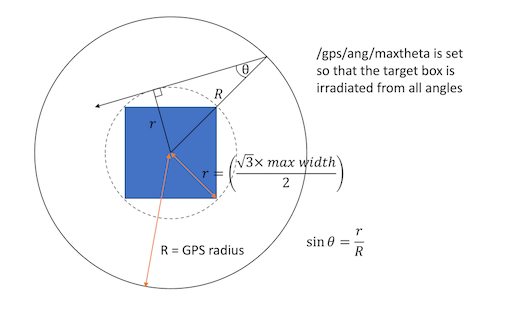

# RBE

## Simulation 
Geant4 simulation of the DNA damage done by alpha-particles, protons, electrons, or Co-60 photons. Energy deposits and OH reactions are scored from the simulation and analysis of the number of strand breaks is performed with the Clustering script. 

 ### Initial Setup on Blue Pebble
 * cd to RBE/simulation
 * make a build directory and cd to it
 * run the following to compile:
```
 
module add tools/cmake/3.17.0.gcc-4.8.5 
module add lang/gcc/9.1.0
 module add apps/geant/4.11.0.0

cmake -DCMAKE_C_COMPILER=/sw/lang/gcc-9.1.0/bin/gcc -DCMAKE_CXX_COMPILER=/sw/lang/gcc-9.1.0/bin/g++ ..
make -j8
```

Repeat for the photon_simulaiton directory if running Co60 simulations.

 ### Description of commandline options and input file

run with ./rbe and options as required:
 - -out filename - to output a root file
 - -ref - to use the reference geometry for photon beams with 2mm build up, corresponding input file is Co60.in
 - -seed - to set the seed
 - -gui - for visualisation (quicker with -chemOFF)
 - -chemOFF - to run without chemistry
 - -sugar - specify file containing deoxyribose positions
 - -histone - specify file containing histone positions
 - -PS - phase space  file from photon simulation

Geometry is determined by the -sugar and -histone files which describe the positions of the deoxyribose, bases and histones. These are created by plotChromatinFibreSection.py. The volume width can be adjusted using volumeWidth and the number of chromatin fibre segments placed with numRows and numColumns - these are spaced uniformly given the volume width. Check there are no overlaps when running the simulation.

The input file can be changed to change the simulation parameters
 - /det/setSize - should match that set for the geometry files
 - /run/numberOfThreads - sets number of threads
 - /gps/particle -  must be alpha, proton, e-
 - /gps/ene/mono - sets the energy of the primaries
 - /gps/pos/.. - can be used to change the distribution of the source
 - /gps/ang/maxtheta - should be set to an angle large enough to cover the whole target box e.g. see below for an example.
 - /scheduler/endTime - the time limit for the radiolysis simulation
 - /run/beamOn - the number of primaries



## Clustering 
Analyses energy depositions and OH reactions from the simulation to count strand breaks. Two files are produced:

    1) Number of individual strand breaks, simple single strand breaks (SSB), complex single strand breaks (cSSB) and DSB. Considering direct damage and indirect damage independently and combined (called total).
    2) Further analysis of DSB breaks, number of strand breaks per cluster are calculated. Here direct and indirect effects both contribute to the formation of DSB. The types of DSB are direct, indirect, mixed, hybrid and total. 

Definitions of strand break types are based on Nikjoo et al Int J Radiat Biol. 1997 May;71(5):467-83.  doi: 10.1080/095530097143798.

 ### Initial Setup on Blue Pebble
- on blue pebble change directory to Clustering and make a build directory. Change to the build directory and then run:
    ```
    module load apps/root/6.26.00
    module load lang/python/miniconda/3.9.7
    module add tools/cmake/3.17.0.gcc-4.8.5 
    module load lang/gcc/7.5.0
    conda create --name clustering python=3.6 scipy numpy pybind11 matplotlib
    conda activate clustering
    ```

- if it is the first time you use conda on blue pebble run:
    ```
    conda init bash
    ```
- close the shell and reopen the shell if directed (modules above will need to be re-loaded)
- change CMakeLists.txt pybind11_DIR and header directories to your environment location. e.g. change USERNAME in the following
    ```
    include_directories(/user/home/USERNAME/.conda/envs/clustering/lib/python3.6/site-packages/pybind11/include/pybind11/)

    set(pybind11_DIR /user/home/USERNAME/.conda/envs/clustering/share/cmake/pybind11)
    ```

- change to the build direcrory to build pyClustering.cc:
    ```
    cmake ..
    make
    ```

- If not using blue pebble create/activate a python environment (called clustering) with the same python version as pyroot (root-config --python-version), and install pybind11, numpy and scipy. 
 
 ## Test Set
There is a test set in testSet to provide examples which can be run to ensure setup is working. See the README in the testSet directory.

 ## Example of how to run an alpha simulation

First create the geometry files. This only needs to be done once for each geometry
1) cd to geometryFiles
2) check the number of rows, columns and volumeWidth in plotChromatinFibreSection.py. (default is 4x4, 300 nm which has a density similar to a typical cell)
2) run:
    ```
    python plotChromatinFibreSection.py 
    ```

To run a simulation:
1) cd to simulation/build
2) open writeInputsAlpha.py. This will write all the scripts and input files required to run a simulation and can be changed as required.
    - slurm = True for blue pebble or False for laptop
    - folder = folder name for results
    - numThreads = max 4 laptop
    - seeds = list of random values to use for the Geant simulation seed value, number of seeds can be changed
    - energies = list of alpha KE for the simulation
    - histoneFile = location of histone geoemtry file
    - sugarFile = location of sugar geoemtry file
    - time = only needed for blue pebble
    - mem = only needed for blue pebble
    - targetSize = size of the target box should match geometry files
    - gpsRadius = radius from which alpha particle source starts, default 1 micrometer
    - printProgress = how often geant reports progress
    - numAlpha = number of alpha particles

3) run
    ```
    python writeInputsAlpha.py
    ```
This makes all the scripts needed to run the simulation and clustering all in one

4) cd results/filename
5) On blue pebble:

    - for each script you want to run e.g alpha_5MeV_1.sh
    ```
    sbatch alpha_5MeV_1.sh
    ```
    the simulation will run and then clustering

5) On laptop:

    - for each script you want to run e.g alpha_5MeV_1.sh, change the permissions to execute the script:
    ``` 
    chmod 755 alpha_5MeV_1.sh 
    ```
    - to start simulation: 
    ```
    ./alpha_5MeV_1.sh etc
    ```
    the simulation will run and then clustering


 ## Example of how to run a Co60 simulation

The photon simulation (Co60) splits the simulation into 2 parts. First the photon primaries are tracked in a simple geometry without the chemistry simulation and any secondary particles saved in a phase space file. Second the full geometry simulaiton with the chemistry is run with the phase space file as the input.

To run a simulation:
1) cd to photon_simulation/build
2) open writeInputsPhoton.py. This will write all the scripts and input files required to run a photon simulation and can be changed as required.
    - slurm = True for blue pebble or False for laptop
    - folder = folder name for results
    - numThreads = max 4 laptop
    - seeds = list of random values to use for the Geant simulation seed value, , number of seeds can be changed
    - histoneFile = location of histone geoemtry file
    - sugarFile = location of sugar geoemtry file
    - timePhoton = only needed for blue pebble, time needed for the photon simulation
    - memPhoton = only needed for blue pebble, memory needed for the photon simulation
    - timeSec = only needed for blue pebble, time needed for the secondary simulation
    - memSec = only needed for blue pebble, memory needed for the secondary simulation
    - targetSize = size of the target box should match geometry files
    - gpsRadius = radius from which the source starts, default 3 mm for photon simulation to ensure charged particle equilibrium
    - printProgress = how often geant reports progress
    - numPhotons = number of photons

3) run
    ```
    python writePhoton.py
    ```
This makes all the scripts needed to run the simulation and clustering all in one

4) cd results/filename
5) On blue pebble:

    - for each script you want to run e.g runPhotonScript_1.sh
    ```
    sbatch runPhotonScript_1.sh
    ```
    the photon simulation will run, then the secondary and then clustering

5) On laptop:

    - for each script you want to run e.g runPhotonScript_1.sh, change the permissions to execute the script:
    ``` 
    chmod 755 runPhotonScript_1.sh 
    ```
    - to start simulation: 
    ```
    ./runPhotonScript_1.sh etc
    ```
    the simulation will run, then the secondary and then clustering
